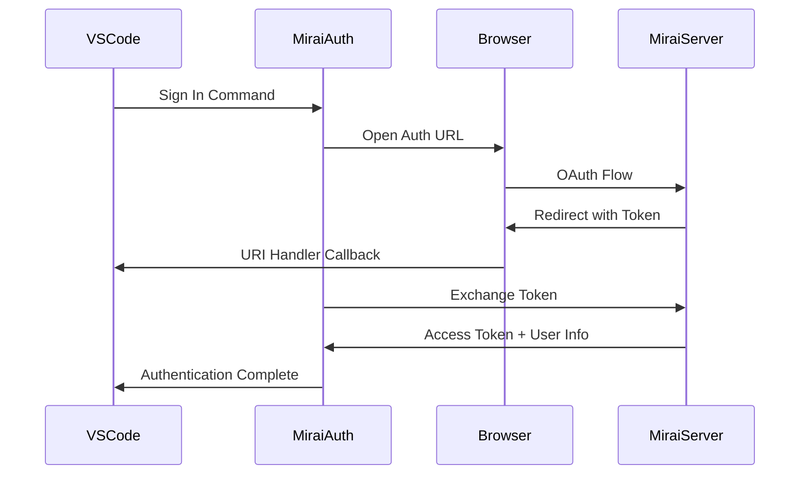

# Mirai Extensions Integration

This document describes the integration of Mirai-Auth, Mirai-Figma, and Mirai-Jira extensions into the VS Code codebase.

## Overview

Three extensions have been integrated to bring Mirai platform functionality directly into VS Code:

1. **Mirai-Auth**: Authentication and credit management
2. **Mirai-Figma**: Figma design integration and component import
3. **Mirai-Jira**: Issue tracking and project management (placeholder)

## Extension Details

### 1. Mirai-Auth Extension

**Location**: `/extensions/mirai-auth/`

**Features**:
- OAuth-like authentication flow with Mirai platform
- Secure token storage and management
- Credit system integration with automatic tracking
- User profile and plan information access
- Automatic token refresh and validation

**Key Files**:
- `src/extension.ts` - Main extension entry point
- `src/authProvider.ts` - Authentication provider implementation
- `src/creditManager.ts` - Credit management and usage tracking
- `src/tokenManager.ts` - Secure token storage and validation

**Commands**:
- `mirai-auth.signIn` - Sign in to Mirai account
- `mirai-auth.signOut` - Sign out from Mirai
- `mirai-auth.checkCredits` - View current credit balance
- `mirai-auth.refreshToken` - Refresh authentication token

**Configuration**:
- `mirai-auth.serverUrl` - Mirai server URL (default: https://mirai.dev)
- `mirai-auth.autoRefresh` - Auto-refresh tokens (default: true)
- `mirai-auth.showCreditNotifications` - Show credit notifications (default: true)

### 2. Mirai-Figma Extension

**Location**: `/extensions/mirai-figma/`

**Features**:
- Figma OAuth authentication and connection management
- Browse Figma teams, projects, and files
- Import components as React, Vue, Angular, or HTML
- Export assets as SVG, PNG, or JPG
- Design token extraction and analysis
- URL-based component import

**Key Files**:
- `src/extension.ts` - Main extension entry point
- `src/figmaProvider.ts` - Figma API integration and connection management
- `src/figmaTreeProvider.ts` - Tree view for browsing Figma files
- `src/componentImporter.ts` - Component import and code generation

**Commands**:
- `mirai-figma.connectFigma` - Connect to Figma account
- `mirai-figma.browseFigma` - Browse Figma files and components
- `mirai-figma.importComponent` - Import selected components
- `mirai-figma.importFromUrl` - Import from Figma URL
- `mirai-figma.refreshConnection` - Refresh Figma connection
- `mirai-figma.disconnectFigma` - Disconnect from Figma

**Configuration**:
- `mirai-figma.serverUrl` - Mirai server URL (default: https://mirai.dev)
- `mirai-figma.autoImportAssets` - Auto-import assets (default: true)
- `mirai-figma.defaultExportFormat` - Export format (default: svg)
- `mirai-figma.componentTemplate` - Component template (default: react)

### 3. Mirai-Jira Extension

**Location**: `/extensions/mirai-jira/`

**Status**: Placeholder implementation - Full integration planned for future releases

**Planned Features**:
- Jira OAuth authentication and connection
- Browse Jira projects and issues
- Create, edit, and update issues
- Link code changes to Jira issues
- Status updates and workflow automation
- Smart commit message parsing

**Key Files**:
- `src/extension.ts` - Main extension entry point (placeholder)
- `src/jiraProvider.ts` - Jira API integration (placeholder)
- `src/jiraTreeProvider.ts` - Tree view for browsing issues (placeholder)
- `src/issueManager.ts` - Issue management (placeholder)

**Commands** (Planned):
- `mirai-jira.connectJira` - Connect to Jira instance
- `mirai-jira.viewIssues` - Browse Jira issues
- `mirai-jira.createIssue` - Create new issue
- `mirai-jira.refreshIssues` - Refresh issue list
- `mirai-jira.disconnectJira` - Disconnect from Jira

## Integration Architecture

### Authentication Flow



### Extension Dependencies

```
mirai-auth (base)
├── mirai-figma (depends on mirai-auth)
└── mirai-jira (depends on mirai-auth)
```

### Credit System Integration

The credit system is centrally managed by the Mirai-Auth extension and used by other extensions:

- **AI Chat**: 5 credits
- **Code Generation**: 15 credits
- **Code Review**: 20 credits
- **Simple UI**: 10 credits
- **Complex UI**: 50 credits
- **Full App**: 200 credits

## API Integration

### Mirai Platform APIs

The extensions integrate with the following Mirai platform APIs:

#### Authentication APIs
- `POST /api/vscode/auth` - Exchange temporary token for access token
- `GET /api/vscode/user` - Get current user information
- `GET /api/vscode/credits` - Get credit balance
- `POST /api/credits/use` - Deduct credits for feature usage

#### Figma APIs
- `GET /api/figma-status` - Check Figma connection status
- `GET /api/figma-files` - Browse teams, projects, files, components
- `GET /api/figma-export` - Export components as images/SVGs
- `DELETE /api/figma-status` - Disconnect Figma account

#### Jira APIs (Planned)
- `GET /api/jira-status` - Check Jira connection status
- `GET /api/jira-projects` - Get Jira projects
- `GET /api/jira-issues` - Get issues for project
- `POST /api/jira-issues` - Create new issue
- `PUT /api/jira-issues/:key` - Update existing issue

## Security Considerations

### Token Management
- Access tokens stored securely using VS Code SecretStorage API
- Automatic token validation and refresh
- CSRF protection during authentication flow
- Secure communication with Mirai servers

### Permission Model
- Extensions require explicit user consent for authentication
- Granular permissions for different API operations
- Secure OAuth flows with state validation
- Token expiration and automatic cleanup

## Installation and Setup

### Prerequisites
1. VS Code 1.74.0 or later
2. Active Mirai account
3. For Figma: Figma account with design file access
4. For Jira: Atlassian Jira instance access (when implemented)

### Installation Steps
1. Install the Mirai-Auth extension (required base)
2. Install additional extensions as needed (Mirai-Figma, Mirai-Jira)
3. Run `Mirai Auth: Sign In` to authenticate
4. Configure individual extensions as needed

### Configuration
Each extension can be configured via VS Code settings:

```json
{
  "mirai-auth.serverUrl": "https://mirai.dev",
  "mirai-auth.autoRefresh": true,
  "mirai-auth.showCreditNotifications": true,

  "mirai-figma.serverUrl": "https://mirai.dev",
  "mirai-figma.autoImportAssets": true,
  "mirai-figma.defaultExportFormat": "svg",
  "mirai-figma.componentTemplate": "react",

  "mirai-jira.serverUrl": "https://mirai.dev",
  "mirai-jira.jiraInstance": "https://yourcompany.atlassian.net",
  "mirai-jira.defaultProject": "PROJ",
  "mirai-jira.autoRefresh": true
}
```

## Usage Examples

### Authentication
```typescript
// Get authenticated session
const session = await vscode.authentication.getSession('mirai', [], { createIfNone: true });

// Use access token for API calls
const response = await fetch('/api/some-endpoint', {
  headers: { 'Authorization': `Bearer ${session.accessToken}` }
});
```

### Credit Management
```typescript
// Check credits before expensive operation
const credits = await creditManager.getCredits();
if (credits.balance < 50) {
  // Show upgrade prompt
}

// Use credits for feature
const success = await creditManager.useCredits('CODE_GENERATION', 15);
```

### Figma Integration
```typescript
// Import component from Figma URL
await componentImporter.importFromUrl('https://www.figma.com/file/ABC123/Design?node-id=1%3A2');

// Browse and select components
await figmaProvider.showFileBrowser();
```

## Development and Testing

### Building Extensions
```bash
# Build all extensions
cd extensions/mirai-auth && npm run compile
cd extensions/mirai-figma && npm run compile
cd extensions/mirai-jira && npm run compile
```

### Testing
- Unit tests for API interactions
- Integration tests with Mirai platform
- E2E tests for user workflows
- Mock implementations for offline testing

### Debugging
- Use VS Code extension development host
- Enable debug logging in extension settings
- Monitor network requests to Mirai APIs
- Check VS Code developer console for errors

## Troubleshooting

### Common Issues

1. **Authentication Failures**
   - Check Mirai server URL configuration
   - Verify network connectivity
   - Clear stored tokens and re-authenticate

2. **Figma Connection Issues**
   - Ensure Figma account has proper permissions
   - Check OAuth app configuration
   - Verify Figma API status

3. **Credit Deduction Failures**
   - Check credit balance
   - Verify authentication status
   - Contact support for billing issues

### Debug Commands
- `Developer: Reload Window` - Reload VS Code window
- `Developer: Show Running Extensions` - View extension status
- `Developer: Open Extension Logs` - View extension logs

## Future Enhancements

### Planned Features
1. **Enhanced Figma Integration**
   - Real-time design sync
   - Component variant support
   - Advanced design token extraction
   - Collaborative design reviews

2. **Full Jira Implementation**
   - Complete API integration
   - Workflow automation
   - Smart commit linking
   - Real-time notifications

3. **Cross-Extension Features**
   - Unified dashboard
   - Shared credit pool
   - Cross-platform synchronization
   - Team collaboration features

### Roadmap
- Q1 2024: Complete Jira integration
- Q2 2024: Enhanced Figma features
- Q3 2024: Team collaboration
- Q4 2024: Advanced automation

## Support and Documentation

- **Documentation**: https://mirai.dev/docs/vscode-extensions
- **API Reference**: https://mirai.dev/docs/api
- **Support**: support@mirai.dev
- **Community**: https://discord.gg/mirai

## License

These extensions are part of the Mirai platform integration and follow the same license terms as the main VS Code project.

